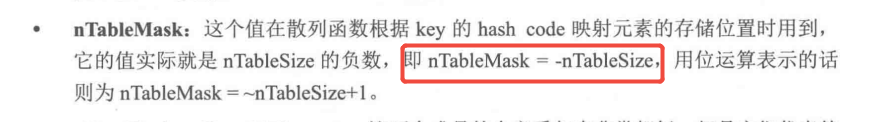

# zend_array结构中nTableMask为什么不是nTableSize的负数呢

## 《PHP7内核剖析》上的知识点




## 实际的效果-基于php7.3.10

### php code

test.php

```
$a = ["xyz"=>1001, "abc"=>1002, "copy"=>1003, "idx"=>1004,"ht"=>1005]
```

### gdb调试php src

```
(gdb) break ZEND_ASSIGN_SPEC_CV_CONST_RETVAL_UNUSED_HANDLER
Breakpoint 1 at 0x75f25e: file /codelocal/php-src-PHP-7.3.10/Zend/zend_vm_execute.h, line 40980.
(gdb) run test.php

(gdb) p value->value->arr->nTableSize
$114 = 8
(gdb) p value->value->arr->nNumUsed
$115 = 5
```

看一下数组的相关信息:

```
(gdb) p value->value->arr
$13 = (zend_array *) 0x7ffff6a63480
(gdb) p *value->value->arr
$14 = {gc = {refcount = 2, u = {type_info = 23}}, u = {v = {flags = 8 '\b', _unused = 0 '\000', nIteratorsCount = 0 '\000', _unused2 = 0 '\000'}, 
    flags = 8}, nTableMask = 4294967280, arData = 0x7ffff6a73340, nNumUsed = 5, nNumOfElements = 5, nTableSize = 8, nInternalPointer = 0, 
  nNextFreeElement = 0, pDestructor = 0x6a985a <zval_ptr_dtor>}
```

可以看到，数组的长度是 nTableSize = 8，那这么说的话理论上【哈希位置=>索引位置】的内存长度也是8(int32_t)，但是我们使用8来查看的话，发现只有索引位置1和3

```
(gdb) x /8dw 0x7ffff6a73340 - 32
0x7ffff6a73320:	-1	-1	3	1
0x7ffff6a73330:	-1	-1	-1	-1
```

**奇怪的是如果我们继续向左8个int32_t的话，发现2和4在 -15和-16的位置**。

```
(gdb) x /16dw 0x7ffff6a73340 - 64
0x7ffff6a73300:	2	4	-1	-1
0x7ffff6a73310:	-1	-1	-1	-1
0x7ffff6a73320:	-1	-1	3	1
0x7ffff6a73330:	-1	-1	-1	-1

可以看到 哈希位置 =>> 索引位置
          -4        1
          -5        3
          -15       4
          -16       2        额外的，2的next指向了bucket:0
```

这么说的话，Bucket数组长度为8(point)，但是Bucket左侧的【哈希位置=>索引位置】的内存长度是 16(int32_t)

我们好像漏掉了一个关键的指标： nTableMask = 4294967280，如果将其强制转为int32_t，值为-16。那么问题就来了，不是说 nTableMask是nTableSize的负数吗，**为什么 nTableSize=8，而nTableMask=16呢**？

```
(gdb) p value->value->arr->nTableMask
$15 = 4294967280
(gdb) p (int32_t)value->value->arr->nTableMask
$16 = -16
(gdb) p value->value->arr->nTableSize
$17 = 8
```


之前在参考书上看到的解释如上，现在看来这个解释至少不适合 7.3.10 版本了，我们捋源码发现有这个一个宏：HT_SIZE_TO_MASK

```
#define HT_SIZE_TO_MASK(nTableSize) \
	((uint32_t)(-((nTableSize) + (nTableSize))))
```

#### nTableMask和nTableSize不一致的原因

先解释这个 HT_SIZE_TO_MASK 这个宏：

1. #### `(nTableSize) + (nTableSize)`

   这一步是将 `nTableSize` 的值乘以 2。之所以要乘以 2，是因为在某些哈希表的设计中，为了更好地利用哈希空间和避免哈希冲突，会使用更大的掩码范围。**乘以 2 可以扩大掩码的覆盖范围，使得哈希值能够更均匀地分布在哈希表中**。

2. #### `-((nTableSize) + (nTableSize))`

   对 `(nTableSize) + (nTableSize)` 的结果取负。取负操作的目的是为了得到一个合适的二进制掩码。在二进制表示中，负数通常采用补码形式存储，补码的特点使得取负操作能够方便地生成一个具有特定位模式的掩码，用于后续的按位与运算。

3. #### `(uint32_t)(-((nTableSize) + (nTableSize)))`

   将取负后的结果强制转换为 `uint32_t` 类型，即无符号的 32 位整数类型。这样做是为了确保最终得到的掩码值是一个无符号的 32 位整数，以便在后续的哈希计算中使用。

具体到当前这个 nTableSize=8的示例

- 当 `nTableSize = 8` 时，`(nTableSize) + (nTableSize)` 的结果为 `16`。
- 对 `16` 取负得到 `-16`，在 32 位有符号整数的补码表示中，`-16` 的二进制形式为 `11111111 11111111 11111111 11110000`。
- 将 `-16` 强制转换为 `uint32_t` 类型，其值仍然是 `4294967280`（十进制），因为无符号整数的解释方式不同，它将 `11111111 11111111 11111111 11110000` 视为一个无符号的 32 位整数。

总结：

***<u>在7.3.10中，nTableMask并不是 -nTableSize，而是将 nTableSize 扩大了一倍取负数。看样子这样是为了扩大掩码范围，是的哈希值更均匀的分布</u>***。